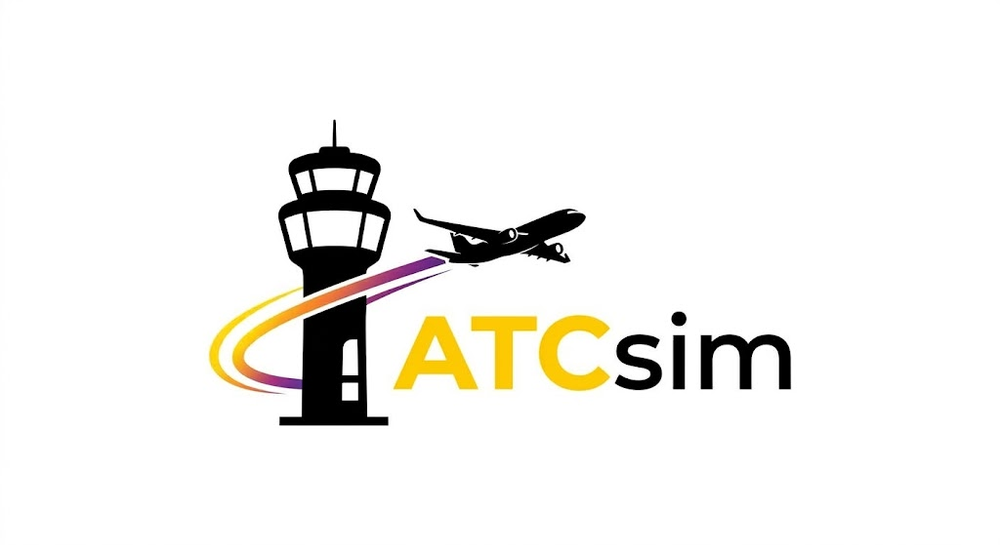

  

<h1 align="center">ATCsim (Air Traffic Control Simulator)</h1>

  <strong>Симулятор диспетчерського контролю та розподілу повітряного руху</strong> 
  <em>Розроблено у межах курсу «Програмна інженерія»</em>

---

## Про проєкт

Зростання щільності повітряного трафіку вимагає ефективних алгоритмів координації та запобігання колізіям. **ATCsim** — це десктопний програмний комплекс для моделювання, візуалізації та аналізу процесів керування повітряним простором.

Система демонструє принципи взаємодії між повітряними суднами і диспетчерськими службами, протоколи радіообміну, а також реакцію системи на зміну зовнішніх метеоумов у режимі реального часу.

## Основний функціонал

* **Інтерактивна навігаційна карта:**
  * Відображення повітряного простору, маршрутів і поточного положення суден.
  * Візуалізація руху літаків у реальному часі з телеметричними даними.

* **Комунікаційний модуль:**
  * Журнал радіообміну між екіпажами літаків та диспетчерськими пунктами.
  * Логування дій, рішень алгоритмів ешелонування та маршрутизації.

* **Керування аеропортовою інфраструктурою:**
  * Відображення повної інформації про аеропорти (статус смуг, доступність).
  * Додавання, модифікація параметрів та видалення вузлів інфраструктури.

* **Контроль та редагування трафіку:**
  * Ручне додавання нових авіарейсів із заданими характеристиками польоту.
  * Коригування поточних маршрутів і параметрів руху.

* **Модуль метеоумов:**
  * Налаштування швидкості та напрямку вітру.
  * Моделювання зон нельотної погоди та погодних аномалій.

## Технічний стек

* **Мова програмування:** C#
* **Платформа:** .NET
* **Графічний інтерфейс:** Windows Presentation Foundation (WPF)

## Системні вимоги та запуск

### Попередні вимоги
* Операційна система: Windows 10 / 11
* Середовище виконання: .NET Desktop Runtime (або встановлений .NET SDK)
* Середовище розробки (для збірки з вихідного коду): Visual Studio 2022 або Rider із підтримкою .NET Desktop Development

### Запуск проєкту

1. Завантажити або клонувати вихідний код проєкту.
2. Відкрити файл рішення `ATCsim.sln` у Visual Studio.
3. Дочекатися відновлення залежностей проєкту.
4. Вибрати конфігурацію збірки `Debug` або `Release`.
5. Запустити проєкт клавішею `F5` або кнопкою `Start` на панелі інструментів.

## Команда розробки

Студенти групи ПМІ-33:
* Безкоровайний Олександр
* Борков Максим
* Рубан Владислава
