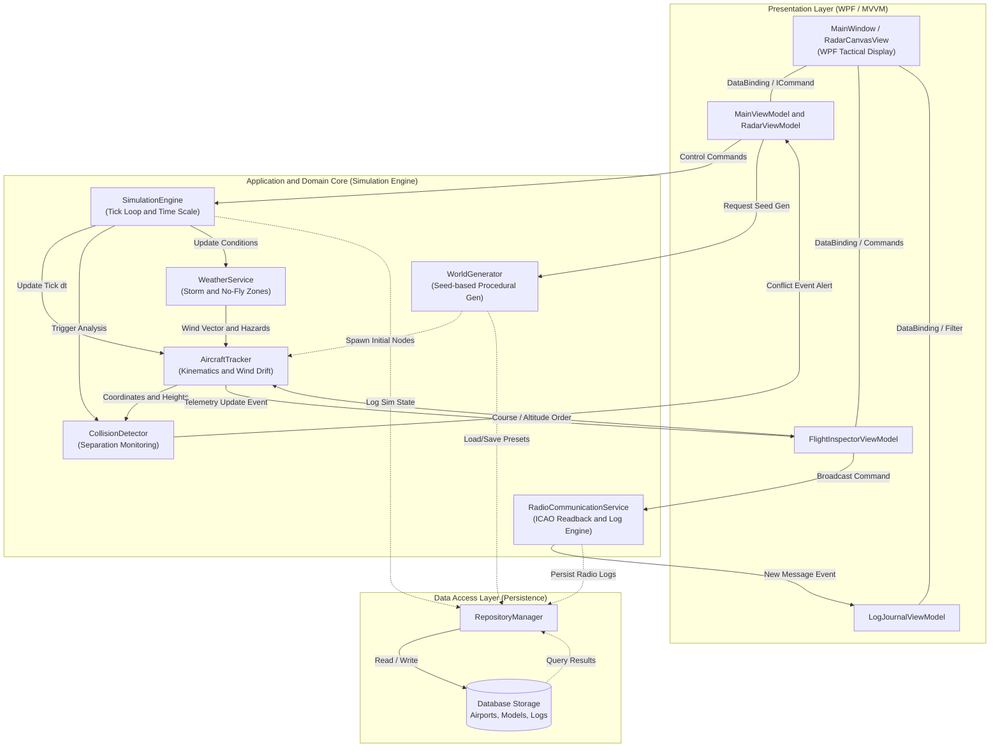
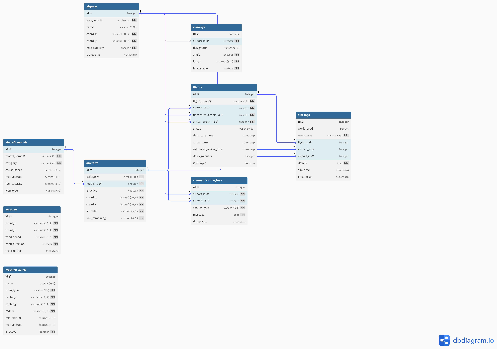

Кафедра програмування

**МІНІСТЕРСТВО ОСВІТИ І НАУКИ УКРАЇНИ**  
Львівський національний університет імені Івана Франка  
Факультет прикладної математики та інформатики  
Програмна інженерія  

# Звіт
лабораторної роботи №4

«Проєктування архітектури та даних для симулятора диспетчерського контролю повітряного руху «ATCsim»»

**Виконали:**  
студенти групи ПМІ-33  
Безкоровайний Олександр  
Борков Максим  
Рубан Владислава  

**Перевірив:**  
ст.Викладач - Галамага Любомир Борисович 

---

**Тема:** Проєктування архітектури та даних

**Мета:** Визначити та обґрунтувати архітектурний підхід для розробки системи диспетчерського контролю «ATCsim», спроєктувати структуру рішення, розподілити функціональні обов'язки між модулями та підсистемами, побудувати схему взаємодії компонентів, зафіксувати реляційну модель даних та обґрунтувати ключові інженерні рішення.

---

## 1. Архітектурний підхід

Для забезпечення масштабованості, високої продуктивності симуляції в реальному часі та незалежності призначеного для користувача інтерфейсу від математичних обчислень у проєкті **ATCsim** обрано комбінацію таких архітектурних патернів:

### 1.1. Багаторівнева архітектура (Layered / Clean Architecture)
Система розділена на чітко розмежовані горизонтальні рівні з односпрямованою залежністю зверху вниз:
1. **Presentation Layer (Рівень представлення):** WPF-інтерфейс, вікна, елементи керування, Canvas-рендеринг карти, візуальні моделі (ViewModels).
2. **Application / Service Layer (Рівень сервісів та симуляції):** координація потоку симуляції, таймери тіків (Tick Loop), диспетчеризація повідомлень радіообміну, реєстрація подій.
3. **Domain / Core Layer (Доменне ядро):** чисті бізнес-сутності предметної області (літаки, аеропорти, зони погоди), математичний апарат кінематики руху, алгоритми виявлення колізій та детермінований генератор світів за числовими сидами.
4. **Data Access / Persistence Layer (Рівень збереження даних):** репозиторії, збереження сесій, робота з базою даних конфігурацій, експорт/імпорт сидів та журналів.

### 1.2. Патерн MVVM (Model-View-ViewModel)
Для розробки графічного інтерфейсу на платформі WPF застосовано патерн **MVVM**:
- **View (XAML):** декларативний опис інтерфейсу користувача (радарний дисплей, панель телеметрії літака, журнал радіообміну, верхній прогрес-бар рейсу). View не містить бізнес-логіки та лише зв'язується з властивостями ViewModel через механізм Data Binding.
- **ViewModel:** інкапсулює стан екрана, адаптує доменні моделі для відображення, реалізує команди (`ICommand`) для обробки дій користувача (зміна курсу, набір висоти, пауза симуляції).
- **Model:** доменні структури даних (`Aircraft`, `Airport`, `Flight`, `WeatherZone`), що надають інформацію про стан системи.

### 1.3. Подійно-орієнтований симуляційний цикл (Event-Driven Simulation Engine)
Розрахунок руху суден виконується детермінованими дискретними кроками (Delta Time) за допомогою високоточного внутрішнього таймера. Зміни просторового положення, настання аварійних подій (порушення ешелонування) або зміна погодних зон транслюються підсистемам через подійну модель (C# events), що виключає жорстке зв'язування компонентів.

---

## 2. Структура рішення (Solution Structure)

Рішення організовано у вигляді модульного Visual Studio Solution (`ATCsim.sln`), розділеного на логічні проєкти за зонами відповідальності:

```
ATCsim.sln
│
├── src/
│   ├── ATCsim.UI/                     # Presentation Layer (WPF)
│   │   ├── Assets/                    # Векторні SVG-іконки, текстури та карти
│   │   ├── Views/                     # XAML вікна та користувацькі елементи
│   │   │   ├── MainWindow.xaml        # Головна тактична консоль диспетчера
│   │   │   ├── RadarCanvasView.xaml   # Компонент радіолокаційної карти
│   │   │   └── LogJournalView.xaml    # Компонент перегляду радіообміну
│   │   ├── ViewModels/                # Презентаційна логіка (MVVM)
│   │   │   ├── MainViewModel.cs       # Головна ViewModel програми
│   │   │   ├── RadarViewModel.cs      # Керування маркерами, бортами і траєкторіями
│   │   │   ├── FlightInspectorVM.cs   # Телеметрія виділеного літака
│   │   │   └── LogsViewModel.cs       # Фільтрація та перегляд журналу подій
│   │   └── Converters/                # XAML Value Converters (градієнти ешелонів тощо)
│   │
│   ├── ATCsim.Core/                   # Domain & Simulation Engine Layer
│   │   ├── Entities/                  # Доменні моделі (Aircraft, Airport, Runway...)
│   │   ├── Kinematics/                # Математична модель руху, розрахунок векторів
│   │   ├── WorldGeneration/           # Процедурний генератор світів на основі сидів
│   │   ├── CollisionDetection/        # Алгоритм аналізу ешелонування (Loss of Separation)
│   │   ├── Weather/                   # Моделювання вітру та небезпечних зон
│   │   └── Services/                  # SimulationEngine, RadioDispatcherService
│   │
│   └── ATCsim.Data/                   # Persistence & Storage Layer
│       ├── Context/                   # Контекст роботи з даними (SQLite / Entity Framework Core)
│       ├── Models/                    # Схеми реляційних сутностей
│       ├── Repositories/              # Доступ до збережених конфігурацій та логів
│       └── Dto/                       # Об'єкти передачі даних для експорту/імпорту
│
└── tests/
    └── ATCsim.Tests/                  # Модульне та інтеграційне тестування
        ├── CollisionTests.cs          # Тестування математики виявлення зближення
        ├── WorldGenTests.cs           # Тестування детермінізму генерації за сидом
        └── KinematicsTests.cs         # Тестування швидкостей, зносу вітром та поворотів
```

---

## 3. Основні компоненти та їхня відповідальність

| Модуль / Компонент | Рівень | Відповідальність та виконувані функції |
| :--- | :--- | :--- |
| **`SimulationEngine`** | Core / Engine | Керує життєвим циклом симуляції (запуск, пауза, скидання, зміна швидкості 1x/2x/4x). Забезпечує детермінований крок обчислень ($\Delta t$). |
| **`WorldGenerator`** | Core / Procedural | Здійснює процедурну детерміновану генерацію простору за введеним числовим сидом (розміщення аеропортів, ЗПС, мережі навігаційних маяків). |
| **`AircraftTracker`** | Core / Kinematics | Обчислює просторові координати суден у реальному часі з урахуванням поточної швидкості, висоти, магнітного курсу та зносу вітром. |
| **`CollisionDetector`** | Core / Safety | Виконує просторовий аналіз взаємного розташування всіх активних бортів. Генерує подію `LossOfSeparationAlert`, якщо дистанція менша за критичну. |
| **`WeatherService`** | Core / Environment | Розраховує векторну сітку швидкості й напрямку вітру та перевіряє потрапляння повітряних суден у межі заборонених штормових зон (`WeatherZone`). |
| **`RadioCommunicationService`** | Core / Comms | Фіксує вказівки диспетчера, генерує процедурні відповіді пілотів (readback) за стандартами ICAO та формує записи журналу радіообміну. |
| **`RadarViewModel`** | UI / Presentation | Транслює географічні та метричні координати об'єктів у координати екрана Canvas, керує візуальним станом градієнта висоти та штрихпунктирної лінії. |
| **`FlightInspectorViewModel`** | UI / Presentation | Надає користувачеві вичерпні телеметричні дані про вибраний літак або аеропорт, обробляє диспетчерські команди відхилення курсу чи зміни ешелону. |
| **`RepositoryManager`** | Data / Storage | Забезпечує збереження та вибірку історії симуляції, конфігурацій аеропортів, каталогів моделей суден та журналів у базу даних. |

---

## 4. Схема взаємодії компонентів

На діаграмі нижче проілюстровано взаємодію між рівнем представлення (WPF UI), симуляційним рушієм, підсистемами аналізу безпеки та рівнем збереження даних:



### Порядок виконання типового симуляційного циклу:
1. **Ініціалізація:** `WorldGenerator` за заданим значенням `Seed` розраховує координати об'єктів світу та розміщує початкові аеропорти та рейси.
2. **Симуляційний крок (Tick):** Таймер `SimulationEngine` генерує сигнал оновлення.
3. **Кінематика:** `AircraftTracker` оновлює просторове положення бортів з урахуванням вектора вітру від `WeatherService`.
4. **Контроль ешелонування:** `CollisionDetector` аналізує відстані між усіма парами суден; у разі небезпечного зближення викликається подія попередження, яка змінює колір індикації на UI.
5. **Відображення (UI Render):** `RadarViewModel` оновлює положення міток на екрані, відмальовуючи суцільну лінію градієнта висоти позаду літака та штрихпунктирну прогнозну лінію попереду.
6. **Журналювання:** `RadioCommunicationService` фіксує радіообмін і зберігає системні логи через `RepositoryManager`.

---

## 5. Модель даних

Для забезпечення надійного зберігання довідкової інформації, параметрів авіаційного флоту, просторових заборонених зон та повного журналу радіообміну й дій розроблено нормалізовану реляційну схему бази даних (ER-діаграму представлено на Рис. 5.1):


*Рис. 5.1. Реляційна модель даних системи ATCsim (ER-діаграма сутностей та зв'язків)*

### Опис сутностей та структури таблиць:

1. **`airports` (Довідник аеропортів):**
   - `id` (PK, integer) — унікальний ідентифікатор;
   - `icao_code` (varchar(4), unique) — 4-символьний міжнародний код ICAO (UKLL, UKBB тощо);
   - `name` (varchar(100)) — повна назва аеропорту;
   - `coord_x`, `coord_y` (decimal) — географічні координати розташування;
   - `max_capacity` (integer) — максимальна місткість стоянок повітряних суден.

2. **`runways` (Злітно-посадкові смуги):**
   - `id` (PK, integer) — ідентифікатор смуги;
   - `airport_id` (FK -> airports.id) — прив'язка до аеропорту розташування;
   - `designator` (varchar(10)) — маркування смуги (наприклад, 13L, 31R);
   - `angle` (integer) — кут/магнітний курс смуги в градусах (0–360°);
   - `length` (decimal) — довжина злітно-посадкової смуги в метрах;
   - `is_available` (boolean) — поточний статус доступності для зльоту/посадки.

3. **`aircraft_models` (Каталог моделей суден):**
   - `id` (PK, integer) — ідентифікатор моделі літака;
   - `model_name` (varchar(50), unique) — найменування літака (Boeing 737-800, Airbus A320, Cessna 172);
   - `category` (varchar(50)) — класифікація судна (HEAVY, PASSENGER, REGIONAL, LIGHT);
   - `cruise_speed` (decimal) — рекомендована крейсерська швидкість у вузлах;
   - `max_altitude` (decimal) — практична стеля висоти польоту у футах;
   - `fuel_capacity` (decimal) — максимальна місткість паливних баків у кілограмах;
   - `icon_type` (varchar(50)) — тип векторного графічного відображення для карти.

4. **`aircrafts` (Екземпляри повітряних суден у симуляції):**
   - `id` (PK, integer) — ідентифікатор судна;
   - `callsign` (varchar(10), unique) — радіопозивний борту (наприклад, UKR102);
   - `model_id` (FK -> aircraft_models.id) — посилання на технічні характеристики моделі;
   - `is_active` (boolean) — прапорець активного перебування судна в повітряному просторі;
   - `coord_x`, `coord_y` (decimal) — поточні просторові координати судна;
   - `altitude` (decimal) — поточна висота польоту (ешелон);
   - `fuel_remaining` (decimal) — залишок пального на борту.

5. **`flights` (Авіарейси):**
   - `id` (PK, integer) — ідентифікатор рейсу;
   - `flight_number` (varchar(10)) — номер рейсу;
   - `aircraft_id` (FK -> aircrafts.id) — призначене повітряне судно;
   - `departure_airport_id` (FK -> airports.id) — аеропорт вильоту;
   - `arrival_airport_id` (FK -> airports.id) — аеропорт призначення;
   - `status` (varchar(20)) — стан рейсу (SCHEDULED, EN_ROUTE, LANDED, CANCELLED);
   - `departure_time`, `arrival_time` (timestamp) — плановий розклад;
   - `estimated_arrival_time` (timestamp) — розрахунковий час прибуття (ETA) з урахуванням поточної швидкості та вітру;
   - `delay_minutes` (integer) — величина відхилення від розкладу у хвилинах;
   - `is_delayed` (boolean) — індикатор наявності затримки рейсу.

6. **`communication_logs` (Журнал радіообміну):**
   - `id` (PK, integer) — ідентифікатор запису переговорів;
   - `airport_id` (FK -> airports.id) — станція керування / вишка диспетчера;
   - `aircraft_id` (FK -> aircrafts.id) — судно, залучене в радіообмін;
   - `sender_type` (varchar(20)) — ініціатор повідомлення (ATC або AIRCRAFT);
   - `message` (text) — повний зміст диспетчерської вказівки або доповіді екіпажу;
   - `timestamp` (timestamp) — точний час радіообміну.

7. **`weather` (Просторові метеорологічні умови):**
   - `id` (PK, integer) — ідентифікатор точки погодних спостережень;
   - `coord_x`, `coord_y` (decimal) — координати точки вимірювання;
   - `wind_speed` (decimal) — швидкість вітру (вузли або м/с);
   - `wind_direction` (integer) — напрямок вітру в градусах (0–360°);
   - `recorded_at` (timestamp) — часова мітка фіксації параметрів.

8. **`weather_zones` (Заборонені та небезпечні зони):**
   - `id` (PK, integer) — ідентифікатор зони;
   - `name` (varchar(100)) — позначення забороненого сектора;
   - `zone_type` (varchar(50)) — тип загрози (STORM, NO_FLY_ZONE, MILITARY_DANGER);
   - `center_x`, `center_y` (decimal) — координати центру небезпечної зони;
   - `radius` (decimal) — радіус дії зони обмеження;
   - `min_altitude`, `max_altitude` (decimal) — висотний діапазон небезпеки;
   - `is_active` (boolean) — поточний статус активності обмеження.

9. **`sim_logs` (Загальний системний лог дій і подій):**
   - `id` (PK, integer) — унікальний номер запису;
   - `world_seed` (bigint) — числовий сид симуляційного світу;
   - `event_type` (varchar(50)) — категорія події (COLLISION_WARNING, TAKEOFF, LANDING, COMMAND);
   - `flight_id`, `aircraft_id`, `airport_id` (FK, nullable) — опціональні прив'язки до сутностей;
   - `details` (text) — докладний зміст події чи алгоритмічного рішення;
   - `sim_time` (timestamp) — внутрішній віртуальний час у симуляції;
   - `created_at` (timestamp) — системний час запису.

---

## 6. Обґрунтування ключових рішень

1. **Вибір стеку C# / .NET 10 / WPF:**  
   Технологія WPF забезпечує апаратне прискорення відмальовування через DirectX, що є критично важливим для плавної візуалізації десятків рухомих об'єктів на навігаційному Canvas із частотою 60 FPS. Сучасна платформа .NET забезпечує строгу типізацію, високу швидкодію математичних обчислень та крос-компонентну інтеграцію за шаблоном MVVM.

2. **Детермінована процедурна генерація за числовими сидами (Seed-based Generation):**  
   Застосування алгоритмів псевдовипадкової генерації на базі сидів дозволяє відтворювати ідентичну топологію аеропортів, ЗПС та погодних аномалій за одним числовим значенням. Це усуває необхідність збереження гігабайтів статичних карт і надає зручний інструмент для стандартизованого тестування студентів та алгоритмів ешелонування на однакових сценаріях.

3. **Розділення симуляційного циклу та UI-потоку:**  
   Розрахунок фізики польоту, вітрового зносу та дистанцій між літаками винесено в окремий симуляційний рушій `SimulationEngine`. Інтерфейс підписується на події оновлення стану, завдяки чому складні розрахунки векторів і виявлення колізій не блокують головний потік інтерфейсу (UI Thread).

4. **Виділення таблиці `aircraft_models` із каталогом технічних характеристик:**  
   Відокремлення екземпляра судна (`aircrafts`) від його фізичної моделі (`aircraft_models`) забезпечує гнучке масштабування симулятора: додавання нових типів суден (від легкомоторних до важких трансконтинентальних лайнерів) відбувається без зміни коду алгоритмів руху, а швидкість набору висоти, витрата пального та тип відображуваної векторної іконки зчитуються з каталогу.

5. **Швейцарський мінімалістичний дизайн консолі керування (Swiss Minimalist HUD):**  
   Відмова від перевантажених темних тем із неоновими градієнтами на користь чіткого білого та світло-сірого фону з тонкими 1px межами, чистою типографікою шрифту **Montserrat** та чорними векторними піктограмами літаків знижує когнітивне навантаження на оператора і відповідає вимогам ергономіки сучасних диспетчерських пультів.

---

## Висновки

У ході виконання лабораторної роботи №4 було успішно спроєктовано системну архітектуру та модель даних для комплексу симуляції диспетчерського контролю «ATCsim». Обґрунтовано використання багаторівневої архітектури та патерну MVVM, сформовано декомпозицію рішення на логічні проєкти, розподілено функціональні обов'язки між ключовими компонентами симуляційного ядра та графічного інтерфейсу, а також побудовано детальну схему їхньої взаємодії. 

На основі вимог до системи було розроблено повноцінну нормалізовану реляційну модель бази даних, що охоплює управління повітряним рухом, злітно-посадковими смугами, моделями літаків, журналом радіообміну та забороненими зонами, заклавши надійний інженерний фундамент для подальшої програмної реалізації.
