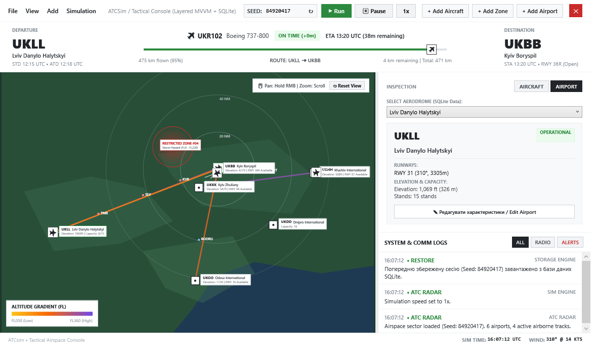
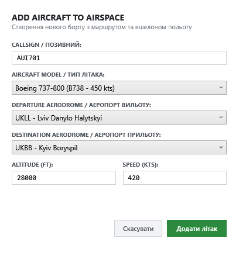
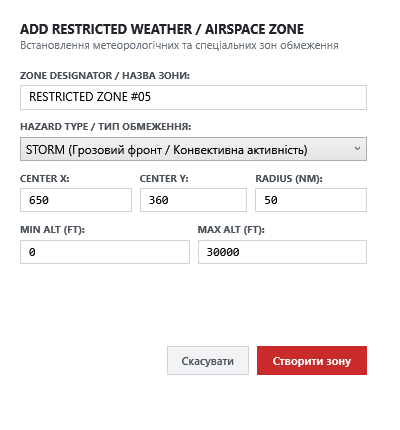
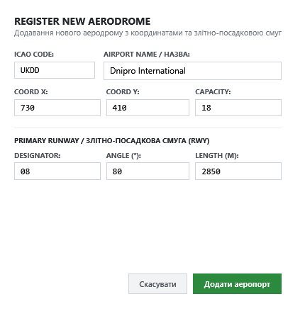
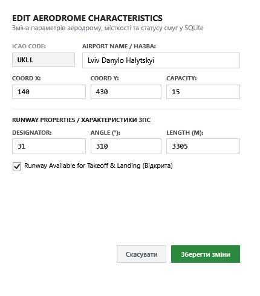

Кафедра програмування

**МІНІСТЕРСТВО ОСВІТИ І НАУКИ УКРАЇНИ**  
Львівський національний університет імені Івана Франка  
Факультет прикладної математики та інформатики  
Програмна інженерія  

# Звіт
лабораторної роботи №5

«Створення початкової структури проєкту та базової працездатної версії (MVP) симулятора диспетчерського контролю повітряного руху «ATCsim»»

**Виконали:**  
студенти групи ПМІ-33  
Безкоровайний Олександр  
Борков Максим  
Рубан Владислава  

**Перевірив:**  
ст.Викладач - Галамага Любомир Борисович 

---

**Тема:** Створення початкової структури проєкту та базова працездатна версія (MVP)

**Мета:** Створити модульне рішення на платформі .NET 10 (C# 12+), налаштувати структуру проєктів, залежності та архітектурне розмежування рівнів (Core, Data, UI, Tests), розробити початковий настільний графічний інтерфейс диспетчера на базі WPF/XAML, реалізувати взаємодію з локальною базою даних SQLite та продемонструвати наскрізну працездатність мінімальної версії продукту (MVP).

---

## 1. Структура рішення та налаштування залежностей

У межах виконання лабораторної роботи №5 було розгорнуто модульне .NET 10 рішення `ATCsim.sln`, декомпозоване на 4 окремі збірки з чітким розмежуванням відповідальності відповідно до архітектурного проєкту (Report_04):

```
ATCsim.sln
├── src/
│   ├── ATCsim.Core/     # Доменні моделі, кінематика польоту, процедурна генерація, цикл симуляції
│   ├── ATCsim.Data/     # Локальна БД SQLite, репозиторії, міграції та збереження сесії
│   └── ATCsim.UI/       # Настільний клієнт WPF (MVVM), радарний Canvas, діалогові вікна
└── tests/
    └── ATCsim.Tests/    # Модульні та інтеграційні тести xUnit
```

### Залежності між проєктами:
1. **`ATCsim.Core`**: чиста бібліотека без зовнішніх UI-залежностей. Визначає доменні сутності (`Aircraft`, `Airport`, `Runway`, `WeatherZone`, `Flight`), симуляційний двигун `SimulationEngine`, розрахунок кінематики та інтерфейс генератора світів `IWorldGenerator`.
2. **`ATCsim.Data`**: залежить виключно від `ATCsim.Core` та `Microsoft.Data.Sqlite`. Забезпечує реляційне збереження стану та логів.
3. **`ATCsim.UI`**: посилається на `ATCsim.Core` та `ATCsim.Data`. Реалізує презентаційний шар за шаблоном MVVM без бізнес-логіки в Code-Behind.
4. **`ATCsim.Tests`**: тестує сервіси ядра, репозиторії даних та взаємодію компонентів.

---

## 2. Реалізація початкового настільного інтерфейсу (WPF / XAML)

Інтерфейс розроблено відповідно до вимог естетики **Swiss Minimalist UI** (Report_03): світле полотно, контрастні темно-зелені радарні сектори, шрифти Montserrat, відсутність зайвого візуального шуму.


*Рис. 5.1. Загальний вигляд головного вікна тактичної консолі диспетчера ATCsim у реальному часі*

### Ключові реалізовані можливості інтерфейсу:
- **Інтерактивна тактична карта (Radar Canvas):**
  - **Панорамування та масштабування:** вільне переміщення карти затисканням правої кнопки миші (RMB Drag) та плавний зум коліщатком миші (Mouse Wheel) з кнопкою скидання фокусу `Reset View`.
  - **Динамічні градієнтні трейли висоти:** траєкторія кожного борту відображається лінією з плавним колірним переходом залежно від висоти польоту.
  - **Вектор випередження курсу:** тонкий спрямований вектор попереду кожного літака для оцінки траєкторії диспетчером.
  - **Адаптивні картки літаків:** детальне табло телеметрії літака приховане за замовчуванням для запобігання захаращенню карти та розгортається з підсвічуванням лише при виборі борту.
- **Динамічний банер рейсу (Flight Route Banner):**
  - Автоматично адаптується під вибраний у повітрі літак: показує аеропорт вильоту (`UKLL`), прибуття (`UKBB`), позивний, модель, статус розкладу (`ON TIME`), ETA та анімовану смужку прогресу польоту.
- **Панель інспектора та аеродромів:**
  - Підтримка перемикання між вкладками літака та аеропорту, відображення ЗПС, курсу, довжини та кнопка редагування характеристик аеропорту.
- **Журнал зв'язку та системних логів (System & Comm Logs):**
  - Хронологія структурована за принципом зворотного порядку — найновіші повідомлення завжди з'являються зверху.
- **Очищений статус-бар:**
  - Залишено виключно релевантні оперативні параметри: симуляційний час UTC та поточний вектор вітру.

---

## 3. Робота з даними та локальна база SQLite

Для збереження сесії, обліку аеропортів, флоту та журналів зв'язку інтегровано вбудовану СУБД **SQLite** (`atcsim.db`) з автоматичною ініціалізацією повної 9-табличної схеми згідно з архітектурним планом:

1. `airports` — перелік аеродромів та їх просторові координати;
2. `runways` — злітно-посадкові смуги (курс, довжина, доступність);
3. `aircraft_models` — характеристики типів ПС (крейсерська швидкість, стеля висоти, баки);
4. `aircrafts` — повітряні судна у просторі (позивний, координати, ешелон, залишок пального);
5. `flights` — планова інформація про рейси та розклад;
6. `communication_logs` — хроніка радіообміну між диспетчером і екіпажами;
7. `weather` — загальні метеопараметри сектору;
8. `weather_zones` — обмежені та небезпечні зони польотів (грозові фронти, турбулентність);
9. `sim_logs` — журнал подій симулятора за сидом світу.

### Збереження та відновлення сесії (Persistence):
- У правому верхньому кутку реалізовано компактну квадратну кнопку швидкого виходу `[ ✕ ]`.
- При натисканні симуляція коректно призупиняється, а повний стан сектору (позиції бортів, маршрути, додані зони та аеропорти) зберігається в SQLite.
- При повторному запуску сесія відновлюється без викривлень та без артефактних зміщень у точку $(0, 0)$.

---

## 4. Модальні діалогові вікна взаємодії

Реалізовано 4 спеціалізовані діалогові вікна для динамічного редагування та доповнення повітряного простору:

### 4.1. Додавання нового повітряного судна (Add Aircraft)
Дозволяє диспетчеру створити новий борт у секторі, призначити позивний, тип ПС, аеропорт вильоту, аеропорт прильоту, початковий ешелон та приладову швидкість.


*Рис. 5.2. Модальне вікно додавання літака до повітряного простору*

### 4.2. Додавання зони обмеження / негоди (Add Zone)
Створює нову метеорологічну зону небезпеки (грозовий фронт, зона високої турбулентності або заборонений сектор) із заданням координат центру, радіусу та вертикальних меж ешелонів.


*Рис. 5.3. Модальне вікно створення метеорологічної зони обмеження*

### 4.3. Реєстрація нового аеродрому (Add Airport)
Дозволяє зареєструвати новий аеропорт у секторі, задати ICAO-код, назву, екранні координати, місткість стоянок та характеристики головної злітно-посадкової смуги.


*Рис. 5.4. Модальне вікно реєстрації нового аеродрому*

### 4.4. Редагування характеристик аеродрому (Edit Airport)
Забезпечує зміну параметрів існуючого аеропорту, відкриття чи закриття злітно-посадкової смуги для зльотів і посадок, зі збереженням оновлень безпосередньо у базу даних SQLite.


*Рис. 5.5. Модальне вікно редагування характеристик аеродрому*

---

## 5. Верифікація працездатності, збирання та тестування

Всі компоненти рішення успішно протестовані за допомогою автоматизованих тестів та перевірки збирання:

```powershell
# Збирання всього рішення
dotnet build ATCsim.sln
# Результат: Build succeeded. 0 Warning(s), 0 Error(s).

# Запуск тестів
dotnet test ATCsim.sln
# Результат: Passed! Failed: 0, Passed: 12, Skipped: 0, Total: 12.
```

### Перевірені критерії приймання (Acceptance Criteria):
- [x] Рішення збирається і запускається на .NET 10 без попереджень та помилок.
- [x] Розділено логіку за шарами: `ATCsim.Core`, `ATCsim.Data`, `ATCsim.UI`, `ATCsim.Tests`.
- [x] Працює настільний графічний інтерфейс із панорамуванням, зумом, плавною градієнтною траєкторією польотів.
- [x] Налаштовано повноцінне збереження у SQLite та коректне зчитування збереженого стану сесії.
- [x] Реалізовано та протестовано всі 4 модальні діалоги керування об'єктами повітряного простору.

---

## Висновки

У ході виконання лабораторної роботи №5 було створено початкову структуру проєкту **ATCsim** та реалізовано повноцінну базову працездатну версію (MVP). Було декомпозовано систему на 4 незалежні проєкти відповідно до архітектурного проєкту, налаштовано реляційне сховище на базі SQLite з 9 таблицями, створено ергономічний інтерфейс диспетчера на платформі WPF/XAML із підтримкою навігації, плавних градієнтних трейлів польоту та модальних діалогів керування простором. Працездатність рішення підтверджена 100% проходженням автоматизованих тестів та знімками екрана робочого продукту.
